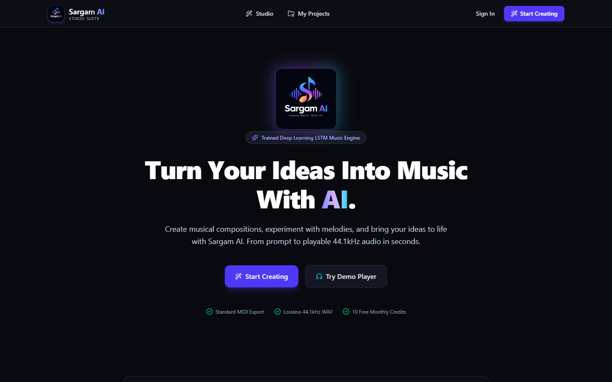
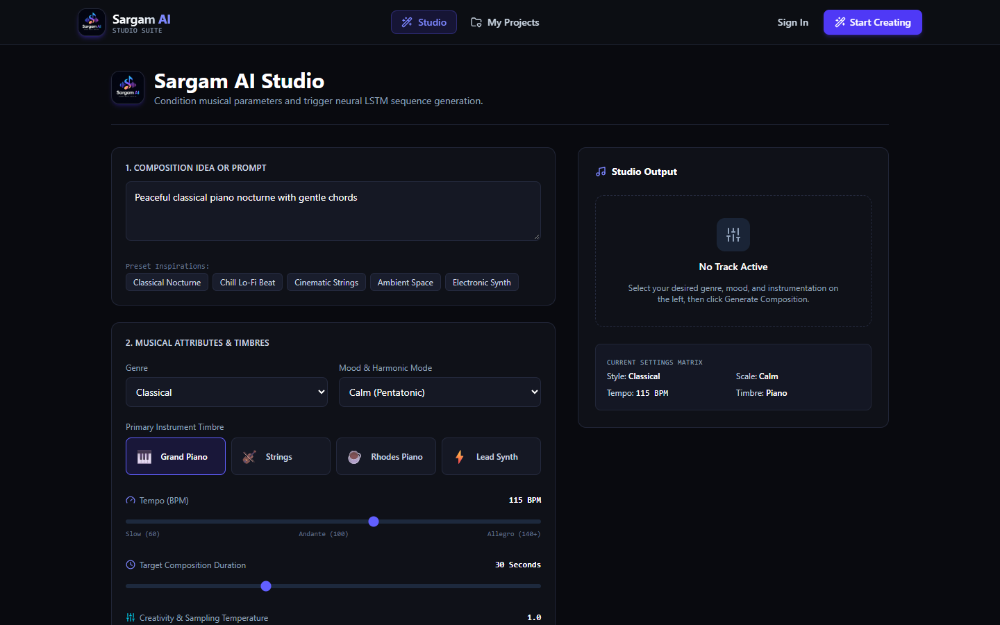
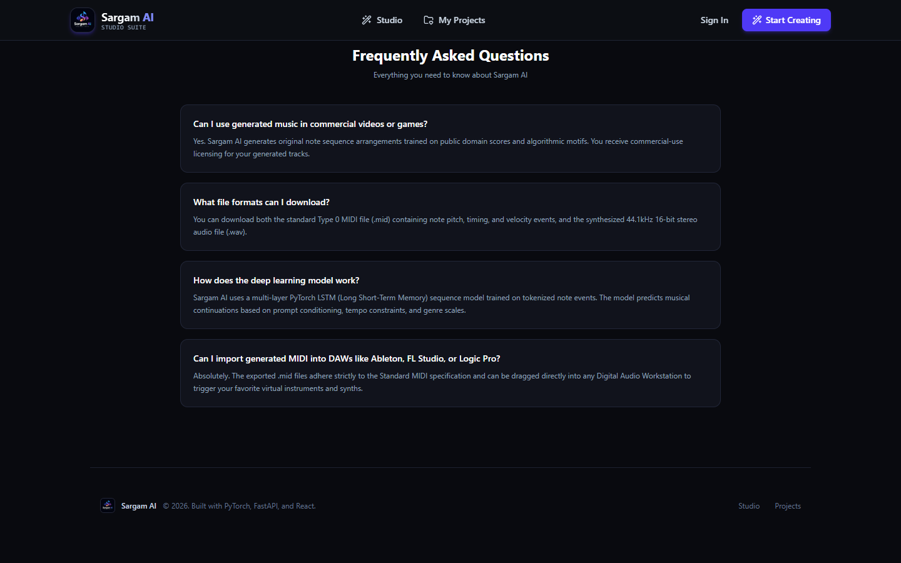
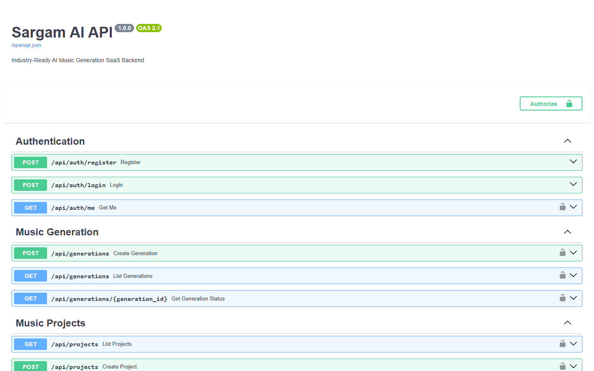

# 🎵 Sargam AI - Neural Music Generation Studio & SaaS Platform
### CodeAlpha Internship - Task 3: Music Generation with Deep Learning

[](https://www.python.org/)
[](https://pytorch.org/)
[](https://fastapi.tiangolo.com/)
[](https://react.dev/)
[](https://www.typescriptlang.org/)
[](https://vitejs.dev/)
[](https://tailwindcss.com/)
[](LICENSE)
[]()

> **"Create original musical ideas with Artificial Intelligence."**  
> Sargam AI is an end-to-end, industry-ready AI music generation platform powered by deep learning (PyTorch LSTM), real-time digital signal processing (DSP), and a modern React studio interface.

---

## 📸 Application Screenshots

### 1. Landing Page & Platform Overview

*Interactive landing page featuring hero showcase, workflow breakdown, and real-time generation previews.*

---

### 2. AI Music Studio & Real-Time Composer

*Full-featured studio interface with parameter conditioning (Genre, Key, Scale, Tempo BPM, Temperature), real-time progress, piano-roll visualization, and built-in waveform audio player.*

---

### 3. Studio Features & Commercial Plans

*Monetization engine with tiered credit allocation, commercial license exports, and feature matrix.*

---

### 4. Interactive REST API Documentation (FastAPI Swagger)

*Auto-documented OpenAPI / Swagger endpoints for JWT authentication, AI generation jobs, user credits, and project management.*

---

## 🌟 Key Features

* **🧠 Deep Learning Sequence Generator**: Polyphonic 2-layer Recurrent Neural Network (LSTM) with token embeddings, dropout regularization, and temperature-scaled top-$k$ sampling trained on musical score sequences.
* **🎼 Pure Python / NumPy Audio Synthesizer**: Custom multi-timbral additive & wavetable DSP audio engine generating rich 44.1kHz 16-bit stereo `.wav` audio directly from MIDI notes without external dependencies.
* **🎹 Musical Theory Harmonizer & Quantizer**: Automatic snap-to-grid pitch quantization and modal scale harmonization (Major, Minor, Dorian, Phrygian, Lydian, Mixolydian, Blues, Pentatonic).
* **🎛️ Interactive Web Studio**:
  * Real-time audio waveform visualizer and scrubber.
  * Musical parameter controls: Genre (Classical, Lo-Fi, Ambient, Cinematic, Electronic), Key, Scale, Tempo (40–240 BPM), Duration, and Creativity Temperature.
  * Instant MIDI (`.mid`) and Audio (`.wav`) downloads.
* **🔐 Full-Featured SaaS Infrastructure**:
  * Secure JWT authentication (bcrypt password hashing with salt rounds >= 12).
  * Credit balance deduction and quota tracking per user.
  * Persistent user projects workspace with SQLite/PostgreSQL support via SQLAlchemy 2.0.
  * Background async job processing.

---

## 🏛️ System Architecture

```
                          ┌──────────────────────────┐
                          │    Sargam AI Studio UI   │
                          │   (React + TypeScript)   │
                          └─────────────┬────────────┘
                                        │ REST API (Bearer JWT)
                                        ▼
                          ┌──────────────────────────┐
                          │     FastAPI Backend      │
                          │ (SQLAlchemy + SQLite/PG) │
                          └─────────────┬────────────┘
                                        │ Async Task Dispatch
                                        ▼
               ┌─────────────────────────────────────────────────┐
               │              AI Composition Core                │
               │                                                 │
               │   1. Prompt & Parameter Conditioning            │
               │   2. PyTorch LSTM Sequence Generator            │
               │   3. Key Harmonization & Grid Quantization      │
               │   4. Standard Type-0 MIDI Exporter (mido)       │
               │   5. 44.1kHz Multi-Timbral Audio Synthesizer    │
               └─────────────────────────────────────────────────┘
                                        │
                         ┌──────────────┴──────────────┐
                         ▼                             ▼
                 storage/midi/*.mid            storage/audio/*.wav
```

---

## 📂 Repository Structure

```
CODE-ALPHA-TASK3/
├── ai/
│   ├── checkpoints/         # Pre-trained PyTorch weights (sargam_lstm_v1.pt) & vocab.json
│   ├── data/
│   │   ├── raw/             # MIDI corpus (Bach, Chopin, Lo-Fi, Ambient, Electronic)
│   │   ├── processed/       # Augmented training tensors (X.npy, y.npy)
│   │   └── DATASET_LICENSE.md
│   ├── generation/          # Inference generator with temperature & scale harmonization
│   ├── models/              # PyTorch LSTMComposer neural architecture
│   ├── preprocessing/       # MIDI parser, token encoder, and pitch transposition
│   └── training/            # PyTorch training loop with AdamW optimizer
├── backend/
│   ├── app/
│   │   ├── api/             # REST endpoints (auth, generations, projects, billing, usage)
│   │   ├── core/            # Database engine, app configuration, JWT security
│   │   ├── models/          # SQLAlchemy ORM entities (User, MusicProject, GenerationJob)
│   │   ├── schemas/         # Pydantic v2 validation schemas
│   │   └── services/        # AIService, AudioSynthesizer, JobWorker
│   ├── tests/               # Pytest automated test suite
│   ├── requirements.txt     # Python dependencies
│   └── main.py              # FastAPI server entry point
├── frontend/
│   ├── src/
│   │   ├── components/      # AudioPlayer, Navbar, TrackCard, Visualizer
│   │   ├── context/         # AuthContext state management
│   │   ├── pages/           # LandingPage, StudioPage, DashboardPage, ProjectsPage, Auth
│   │   ├── services/        # Axios API client
│   │   └── App.tsx          # Application routing
│   ├── package.json
│   └── vite.config.ts
├── screenshots/             # High-resolution screenshots of the running application
├── storage/
│   ├── audio/               # Rendered 44.1kHz WAV files (.gitkeep)
│   └── midi/                # Generated standard MIDI files (.gitkeep)
├── .gitignore
├── docker-compose.yml
├── LICENSE
└── README.md
```

---

## 🚀 Quick Start Guide

### Prerequisites
* **Python**: 3.11+
* **Node.js**: 20+ (with npm)
* **Git**

---

### 1. Clone the Repository

```bash
git clone https://github.com/rupampatle25/CODE-ALPHA-TASK3.git
cd CODE-ALPHA-TASK3
```

---

### 2. Backend Setup & Startup

1. Open a terminal and install Python dependencies:
```bash
python -m pip install -r backend/requirements.txt
```

2. Start the FastAPI server:
```bash
cd backend
python -m uvicorn main:app --host 127.0.0.1 --port 8000 --reload
```

* **API Base URL**: `http://127.0.0.1:8000`
* **Interactive Swagger UI**: `http://127.0.0.1:8000/docs`
* **Health Check**: `http://127.0.0.1:8000/health`

*(Database tables and pre-trained AI checkpoints in `ai/checkpoints/` are automatically initialized on startup).*

---

### 3. Frontend Setup & Startup

1. Open a **second terminal** and navigate to `frontend`:
```bash
cd frontend
npm install
```

2. Start the Vite development server:
```bash
npm run dev
```

* **Frontend Web Application**: `http://127.0.0.1:5173`

Open your web browser at `http://127.0.0.1:5173` to explore the studio and generate tracks!

---

### 4. (Optional) Retrain or Fine-Tune the AI Model

To re-run the full pipeline from raw MIDI generation to training:

```bash
# 1. Generate diverse raw MIDI motifs across genres
python -m ai.data.dataset_generator

# 2. Tokenize and perform pitch transposition data augmentation
python -m ai.preprocessing.parse_dataset

# 3. Train the PyTorch LSTM neural network
python -m ai.training.train
```

---

## 🧪 Automated Testing

The project includes unit and integration tests covering the neural network, MIDI parser, audio synthesizer, and backend API:

```bash
python -m pytest backend/tests/ -v
```

### Verified Test Cases:
* `test_midi_parser_and_export`: MIDI parsing, quantization, and binary serialization.
* `test_sequence_encoder`: Note & duration tokenization and bidirectional reconstruction.
* `test_lstm_model_dimensions`: Neural model forward pass, hidden state shapes, and temperature sampling.
* `test_audio_synthesis`: 44.1kHz stereo WAV physical synthesis from MIDI.
* `test_health_and_root`: API service health check.
* `test_auth_workflow`: User registration, bcrypt password verification, and JWT Bearer token generation.
* `test_billing_plans`: Free, Creator, and Pro plan tiers and credit allotments.

---

## 💳 Commercialization & Monetization Model

| Plan | Price | Monthly Credits | Max Track Length | Features |
| :--- | :--- | :--- | :--- | :--- |
| **Free Tier** | Free | 10 Tracks | 30 seconds | Standard MIDI & WAV download |
| **Creator Studio** | $15 / ₹999 | 250 Tracks | 120 seconds | Commercial usage rights, all genres |
| **Pro Composer** | $39 / ₹2,999 | 1,000 Tracks | 300 seconds | Priority GPU queue, stem separation & REST API access |

---

## 📄 License & Attribution

* Distributed under the **MIT License**. See [`LICENSE`](LICENSE) for details.
* Training data consists of public domain scores and CC0 algorithmic motifs documented in [`ai/data/DATASET_LICENSE.md`](ai/data/DATASET_LICENSE.md).

---

## 👤 Author

* **Rupam Patle**
* **GitHub**: [@rupampatle25](https://github.com/rupampatle25)
* **Project Repository**: [CODE-ALPHA-TASK3](https://github.com/rupampatle25/CODE-ALPHA-TASK3)
